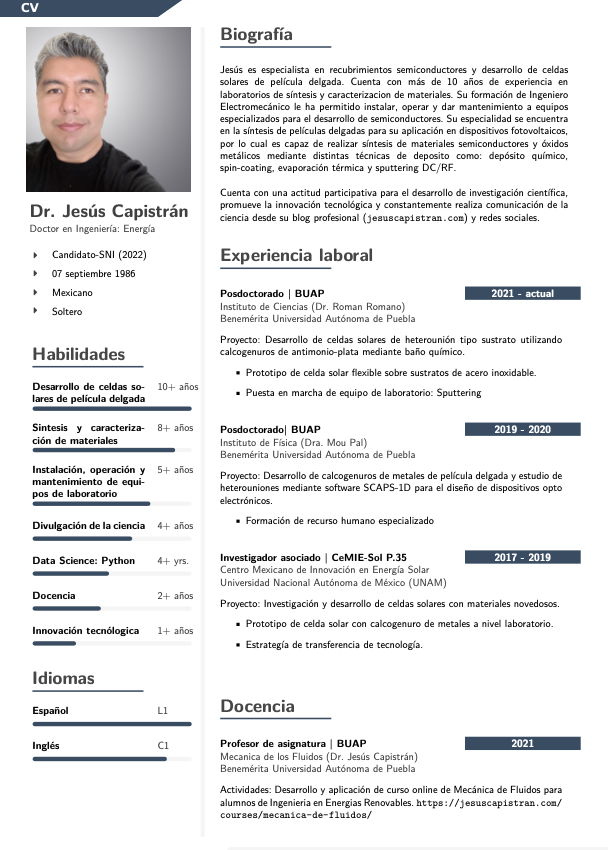
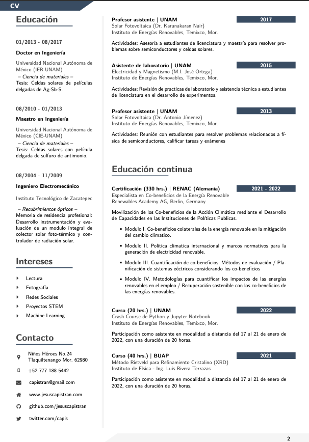
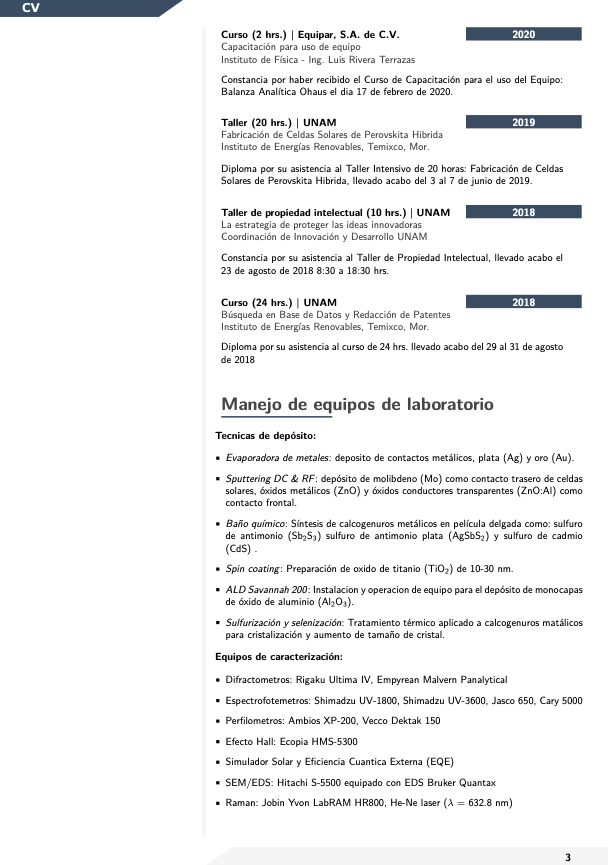
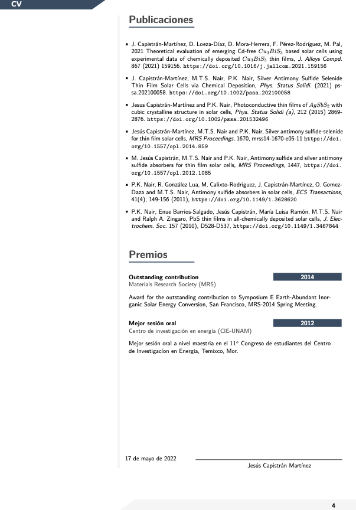

  

  A professional and modern LaTeX CV (Spanish version)

## 

El presente curriculum vitae (CV) es un fork del repositorio   [modern-latex-cv](https://github.com/philipempl/modern-latex-cv)   (English an German version) de [@philipempl](https://github.com/philipempl/modern-latex-cv) . El repositorio contiene la versión en español de la plantilla original.  Si te ha sido util, puedes colocar una :star:. 

## Vista previa

## Proceso de creación (archivo PDF)

- Clonar o descargar el repositorio
- Instalar tu entorno favorito de Latex: [TEXMaker](https://www.xm1math.net/texmaker/) o [Overleaf](https://de.overleaf.com/project/new/template/18551?id=52307932&latexEngine=pdflatex&mainFile=main.tex&templateName=modern-latex-cv&texImage=texlive-full%3A2021.1) 
- Crea tu archivo pdf con: pdflatex
